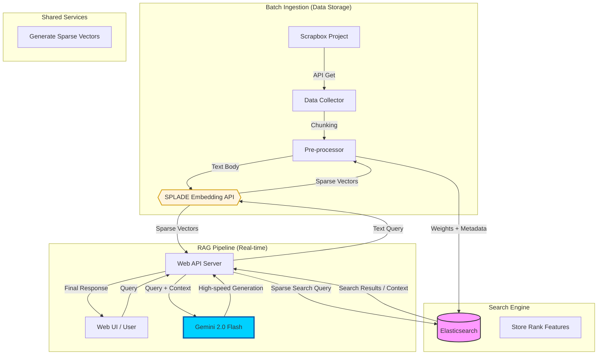

# RAGシステム処理フロー：Scrapbox + SPLADE + Elasticsearch + Gemini 2.0 Flash

## 1. データ蓄積フェーズ（バッチ処理）

Scrapboxの知識を検索可能な状態でElasticsearchに格納するプロセスです。

1. **データ取得**
   - Scrapbox APIを利用し、対象プロジェクトから全ページデータをJSON形式で取得します。
2. **前処理・分割（Chunking）**
   - ページが長い場合、意味のまとまりごとにテキストを適切な長さに分割します。
   - この際、ページタイトル、最終更新日、URLなどのメタ情報を各チャンクに付与します。
3. **スパースベクトル化（SPLADE API）**
   - 分割したテキストを、分離された **SPLADE Embedding API** に送信します。
   - API内部のBERTモデルが、テキストを「語彙拡張（Expansion）」されたスパースベクトル（単語重みの集合）に変換します。
4. **インデックス登録**
   - テキスト、メタデータ、およびSPLADEから返されたベクトル重みを **Elasticsearch** の `rank_features` フィールド等に格納します。

---

## 2. 検索・回答生成フェーズ（リアルタイム処理）

ユーザーの質問に対して、最適な情報を検索し回答を生成するプロセスです。

1. **クエリ受信**
   - Web UIからユーザーの質問（クエリ）をWeb APIサーバーが受け取ります。
2. **クエリのベクトル化**
   - 質問テキストを **SPLADE Embedding API** に送り、蓄積時と同じモデルでスパースベクトルに変換します。
3. **スパース検索（Retrieval）**
   - 生成されたベクトルを用いて **Elasticsearch** に対して検索を実行します。
   - 従来のキーワード検索（BM25）と、SPLADEによる「意味の拡張」を組み合わせた高度な関連性検索が行われます。
4. **コンテキスト構築**
   - 検索結果からスコアの高い上位数件のテキスト（コンテキスト）と、その出典（Scrapbox URL）を抽出します。
5. **回答生成（Generation）**
   - **Gemini 2.0 Flash** に対し、以下の情報をプロンプトとして入力します。
     - **システム指示**: 「提供されたScrapboxの情報のみに基づいて回答してください」
     - **コンテキスト**: Elasticsearchから取得した関連
